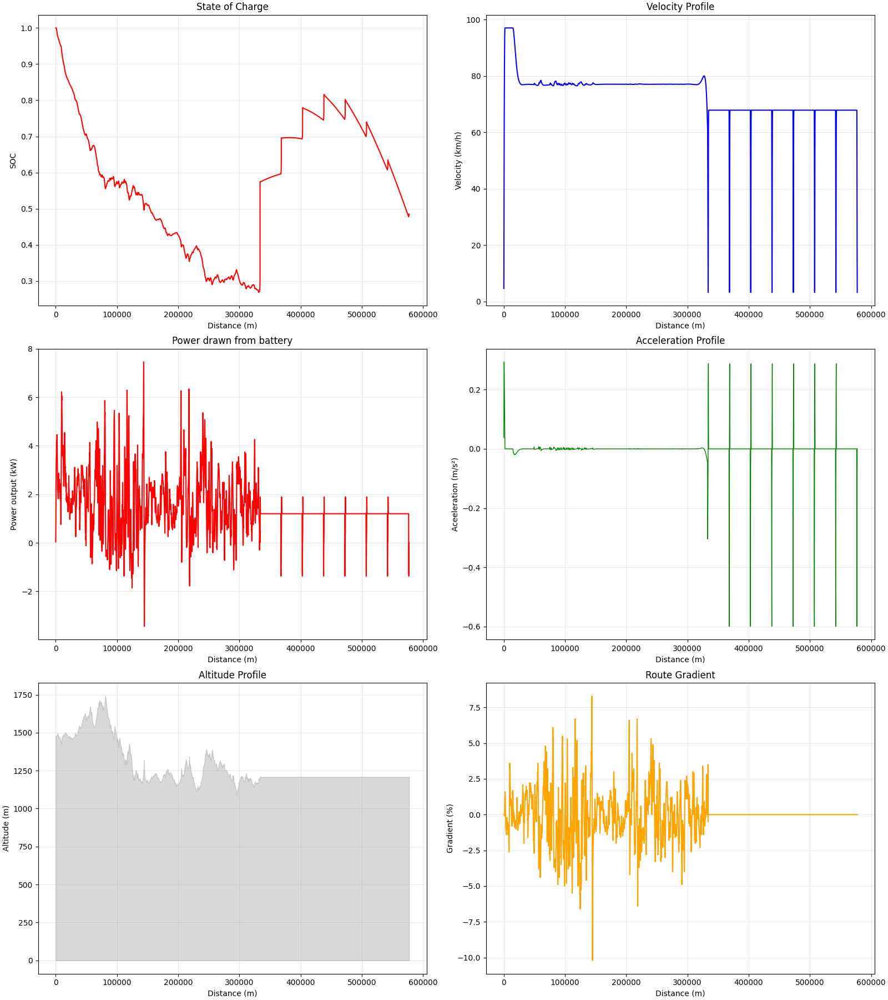
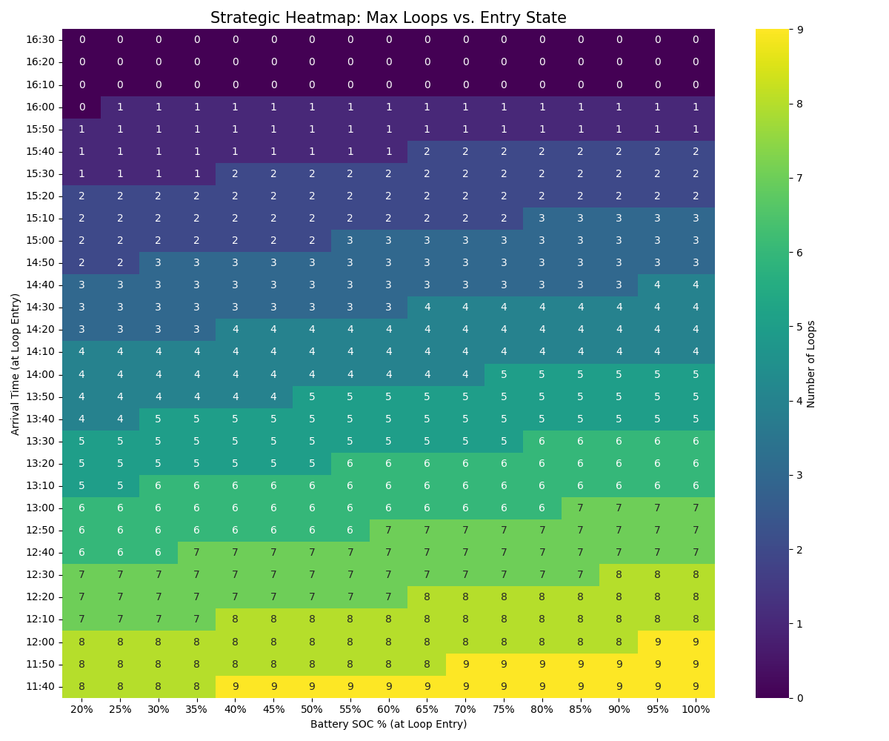

# Agnirath '26 Strategy Final Challenge
Public repo containing my code for the final challenge along with the respective plots, and csv files.

## System Architecture
```text
- Strategy Engine: Python 3.13
- Hardware: i7-13620H 13th Gen (10 Physical Cores)
- Libraries: NumPy (Vectorized Physics), SciPy (SLSQP Optimizer)
- Parallelization: concurrent.futures (Multi-processing across 6 cores)
```
## Mathematical Assumptions
- Straight-line physics assumed during loop maximization phase
- Power losses due to electrical subsystems is 100W
- Drag coefficient factor of 0.12
- Coefficient of rolling resistance of 0.05
- Efficiency of solar panel ~24%
- Modelled the velocity profile from rest to max speed using the sigmoid function, instead of jumping directly from 0 to 90km/h

## Analytical Insights
- The velocity profile converges to a smooth curve of roughly constant velocity, this shows that the power cost of resisting the $v^3$ curve outweighs the beneficts of aggressive speed bursts.
- During loop maximization phase, it is clearly visible that during the solar irradiance is decreasing as depicted by the decrease in the length of the vertical lines in the plot of SoC vs Distance. Hence the earlier that Zeerust is reached, the better.
- The sigmoid ramps between loops depict the costs of stopping and starting.
- There is a direct corelation between the gradient and power output as seen by the similarity of the graphs

## Computational Optimization
- 2 models were used, one to optimize the velocity profile such that Zeerust is reached by a certain time and with a certain SoC, and the other to maximise number of loops taken around Zeerust for the given time reached and SoC.
- Model 1 (used to optimize velocity profile) was computationally a lot heavier than Model 2 (loop maximization). So it isn't feasible to run Model 1 for all possible arrival time, SoC combinations. Hence I first created a heatmap depicting the maximum number of loops that can be achieved with respect to the arrival time and the SoC at the time of arrival. Then by choosing only the lowest SoC for a given arrival time and maximum number of loops, I validated the feasibility of the solution with Model 1.
- Since there is a time limit of 10-15 minutes, it is not feasible to run the optimizations sequentially, that's when I turned to parallel computing. Using a maximum of 6 cores, I ran the optimizations in the order of highest number of loops first, that way I was guaranteed to get the optimum result first.
- This computation took ~12 minutes on my laptop.

## Output
```
Not feasible for arrival at 11:40 with an SoC of 0.4
Not feasible for arrival at 12:10 with an SoC of 0.4
Not feasible for arrival at 11:40 with an SoC of 0.2
Not feasible for arrival at 12:00 with an SoC of 0.2
Not feasible for arrival at 11:50 with an SoC of 0.2
Not feasible for arrival at 12:10 with an SoC of 0.2
Arrival at 12:30 with an SoC of 0.2 is feasible
Winner found:  70%|█████████████████████████████████████████████████████████████████████████▌                               | 7/10 [11:13<04:48, 96.28s/it]
--- OPTIMIZATION COMPLETE ---
Reaching Zeerust with
SOC: 0.4374459288492347, Time: 12:33
No. of loops: 7
Total distance covered: 578600.0m
Exeecution took 11.0m 14s
```
### Graphs generated
#### SoC, Power output, Velocity and Acceleration Profile

#### Loop heatmap

